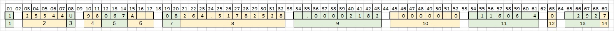

<h2>Two Line Element Set Notes</h2>
<em>Source: https://en.wikipedia.org/wiki/Two-line_element_set</em>

 

__Line 1__

</img>

<table>
  <thead>
    <tr>
      <th>Field</th>
      <th>Columns</th>
      <th>Content</th>
      <th>Example</th>
    </tr>
  </thead>
  <tbody>
    <tr>
      <td>1</td>
      <td>01</td>
      <td>Line number</td>
      <td>1</td>
    </tr>
    <tr>
      <td>2</td>
      <td>03–07</td>
      <td>Satellite catalog number</td>
      <td>25544</td>
    </tr>
    <tr>
      <td>3</td>
      <td>08</td>
      <td>Classification (U: unclassified, C: classified, S: secret)</td>
      <td>U</td>
    </tr>
    <tr>
      <td>4</td>
      <td>10–11</td>
      <td>International Designator (last two digits of launch year)</td>
      <td>98</td>
    </tr>
    <tr>
      <td>5</td>
      <td>12–14</td>
      <td>International Designator (launch number of the year)</td>
      <td>067</td>
    </tr>
    <tr>
      <td>6</td>
      <td>15–17</td>
      <td>International Designator (piece of the launch)</td>
      <td>A</td>
    </tr>
    <tr>
      <td>7</td>
      <td>19–20</td>
      <td>Epoch year (last two digits of year)</td>
      <td>08</td>
    </tr>
    <tr>
      <td>8</td>
      <td>21–32</td>
      <td>Epoch (day of the year and fractional portion of the day)</td>
      <td>264.51782528</td>
    </tr>
    <tr>
      <td>9</td>
      <td>34–43</td>
      <td>First derivative of mean motion; the ballistic coefficient</td>
      <td>-.00002182</td>
    </tr>
    <tr>
      <td>10</td>
      <td>45–52</td>
      <td>Second derivative of mean motion (decimal point assumed)</td>
      <td>00000-0</td>
    </tr>
    <tr>
      <td>11</td>
      <td>54–61</td>
      <td>B*, the drag term, or radiation pressure coefficient (decimal point assumed)</td>
      <td>-11606-4</td>
    </tr>
    <tr>
      <td>12</td>
      <td>63</td>
      <td>Ephemeris type (always zero; only used in undistributed TLE data)</td>
      <td>0</td>
    </tr>
    <tr>
      <td>13</td>
      <td>65–68</td>
      <td>Element set number. Incremented when a new TLE is generated for this object.</td>
      <td>292</td>
    </tr>
    <tr>
      <td>14</td>
      <td>69</td>
      <td>Checksum (modulo 10)</td>
      <td>7</td>
    </tr>
  </tbody>
</table>

 

__Line 2__

</img>

<table>
  <thead>
    <tr>
      <th>Field</th>
      <th>Columns</th>
      <th>Content</th>
      <th>Example</th>
    </tr>
  </thead>
  <tbody>
    <tr>
      <td>1</td>
      <td>01</td>
      <td>Line number</td>
      <td>2</td>
    </tr>
    <tr>
      <td>2</td>
      <td>03–07</td>
      <td>Satellite Catalog number</td>
      <td>25544</td>
    </tr>
    <tr>
      <td>3</td>
      <td>09–16</td>
      <td>Inclination (degrees)</td>
      <td>51.6416</td>
    </tr>
    <tr>
      <td>4</td>
      <td>18–25</td>
      <td>Right ascension of the ascending node (degrees)</td>
      <td>247.4627</td>
    </tr>
    <tr>
      <td>5</td>
      <td>27–33</td>
      <td>Eccentricity (decimal point assumed)</td>
      <td>0006703</td>
    </tr>
    <tr>
      <td>6</td>
      <td>35–42</td>
      <td>Argument of perigee (degrees)</td>
      <td>130.5360</td>
    </tr>
    <tr>
      <td>7</td>
      <td>44–51</td>
      <td>Mean anomaly (degrees)</td>
      <td>325.0288</td>
    </tr>
    <tr>
      <td>8</td>
      <td>53–63</td>
      <td>Mean motion (revolutions per day)</td>
      <td>15.72125391</td>
    </tr>
    <tr>
      <td>9</td>
      <td>64–68</td>
      <td>Revolution number at epoch (revolutions)</td>
      <td>56353</td>
    </tr>
    <tr>
      <td>10</td>
      <td>69</td>
      <td>Checksum (modulo 10)</td>
      <td>7</td>
    </tr>
  </tbody>
</table>

  

